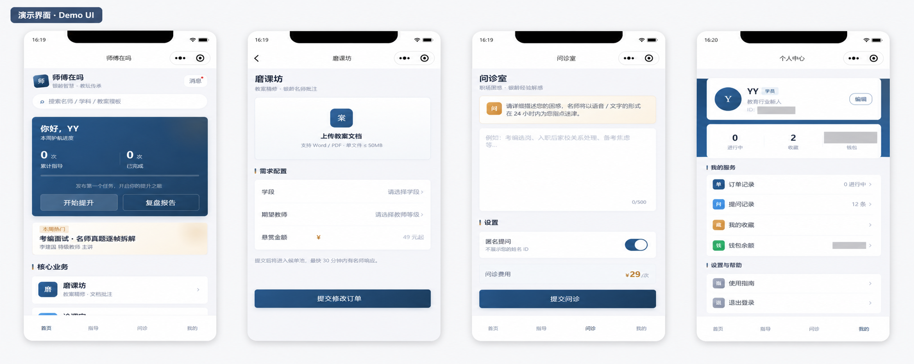
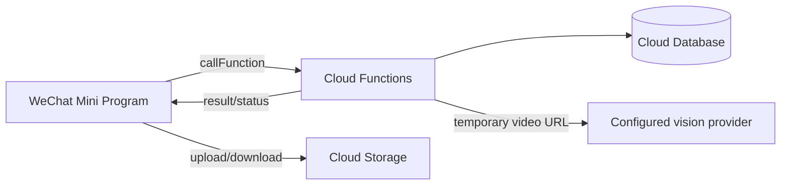

# Shifu Zaima / 师傅在吗

[简体中文](README.zh-CN.md) · [Contributing](CONTRIBUTING.md) · [Security](SECURITY.md) · [Roadmap](docs/ROADMAP.md)

Shifu Zaima is an open-source WeChat Mini Program reference implementation for connecting pre-service teachers and early-career educators with experienced mentors. The Mini Program uses the Chinese product name “师傅在吗”; `yinjiao-bangbang` is retained as the repository's historical code identifier. It combines lesson-plan review, teaching-video analysis, anonymous questions, order workflows, and in-app messaging on WeChat Cloud Development.

> **Project status:** public reference implementation / early beta. It is suitable for learning, evaluation, and further development, but it is not a hosted production service. Payment and wallet behavior is simulated. Mentor access uses an explicit approval state and server-side checks; production deployments must still provide a lawful identity-verification and audited reviewer process.

## Interface preview



The overview combines the home, lesson-plan review, teaching Q&A, and profile screens. Identifiers and wallet balances are masked; all prices and account information shown in the interface are demo data rather than evidence of real transactions or users.

## Why this project exists

Teaching experience is often shared through informal, closed channels. This project explores a reusable workflow for turning that exchange into a structured service:

- pre-service teachers can request feedback on lesson plans and trial lessons;
- experienced educators can review requests and provide asynchronous guidance;
- project teams can study a native Mini Program architecture built with Cloud Functions;
- education developers can reuse documented workflows instead of starting from an empty scaffold.

## Features

| Area | Current capability |
| --- | --- |
| Lesson-plan review | Upload a document and create a review request |
| Teaching-video analysis | Upload a video and create an asynchronous analysis task |
| Teaching Q&A | Submit teaching questions and browse educational content |
| Mentor workspace | Browse, claim, reply to, and complete guidance orders |
| Messaging | Per-order text and voice conversations with membership checks |
| Profiles | Student profiles plus independently approved mentor access |
| Offline preview | Local fallback data for interface exploration |

The current video-analysis adapter calls Zhipu GLM-4V. It is isolated in `cloudfunctions/analyzeVideo` so that additional model providers can be added without changing the Mini Program pages.

## Architecture



Client pages handle presentation and local interaction. Mutations involving profiles, orders, conversations, and messages are routed through Cloud Functions, which derive the caller identity from WeChat `OPENID`. See [Architecture](docs/ARCHITECTURE.md) and [Deployment](docs/DEPLOYMENT.md) for the trust boundaries and collection model.

## Repository structure

```text
.
├── pages/                  # Mini Program pages
├── cloudfunctions/         # Authenticated server-side operations
├── docs/                   # Architecture, deployment, and roadmap
├── security/               # Database and storage security-rule examples
├── scripts/                # Repository validation
├── tests/                  # Structural tests
├── utils/                  # Shared Mini Program client utilities
├── app.js                  # Application entry point
├── app.json                # Pages and global UI configuration
├── project.config.json     # Generic WeChat DevTools configuration
└── seed-contents.json      # Non-sensitive sample content
```

## Quick start

### Prerequisites

- WeChat Developer Tools with Cloud Development enabled
- A WeChat Mini Program AppID for cloud features
- Node.js 18 or newer for repository validation

### 1. Clone and validate

```bash
git clone https://github.com/YxCarl/yinjiao-bangbang.git
cd yinjiao-bangbang
npm test
```

The repository uses `touristappid` and contains no production cloud-environment identifier. Configure your own AppID and select your own cloud environment locally before deploying.

### 2. Create the database collections

Create these collections in the Cloud Development console:

- `users`
- `orders`
- `messages`
- `conversations`
- `contents`
- `aiTasks`
- `rateLimits`

Do not grant public write access. Client pages should call Cloud Functions for protected mutations.

### 3. Deploy Cloud Functions

Upload and deploy every directory under `cloudfunctions/`. Install cloud dependencies when prompted by WeChat Developer Tools.

Apply the database and storage rules only after deploying `getProtectedFileURL`; follow the safe rollout and negative-test matrix in [Security rules](docs/SECURITY_RULES.md). To enable video analysis, configure `ZHIPU_API_KEY` as a server-side environment variable for the `analyzeVideo` Cloud Function. The video flow uses server-issued upload paths, three new tasks per caller per hour, an actual object-size check below 200MB, asynchronous provider jobs, resumable polling, and bounded provider requests. Never store provider keys in client code, public database collections, screenshots, issues, or commits.

### 4. Load optional sample content

Import `seed-contents.json` into the `contents` collection if you want the example resource pages to contain data.

Detailed setup and a production-hardening checklist are available in [docs/DEPLOYMENT.md](docs/DEPLOYMENT.md).

## Reproducible validation

`npm test` runs repository validation, authorization-policy checks, and behavior-level tests for selected order and messaging Cloud Functions. The behavior suite executes the same dependency-injected handlers exported by the deployed entry points, with deterministic in-memory database adapters and no private cloud credentials. Covered order behavior includes atomic creation and replay-safe request IDs; CloudBase transaction execution still requires isolated-environment verification.

These tests establish local business and authorization behavior; they do not claim that CloudBase SDK queries, environment permissions, or deployed security rules have run. The evidence levels and isolated-environment matrix are documented in [Testing and evidence](docs/TESTING.md).

## Security and privacy notes

- A temporary URL for an uploaded teaching video is sent to the configured external model provider when analysis is enabled. Obtain informed consent and define a retention policy before processing real classroom recordings.
- Selecting the mentor entry point creates no mentor privilege. Applications remain on student permissions until a trusted operator records explicit approval; see [Mentor approval](docs/MENTOR_APPROVAL.md).
- Database and storage rules are deployment-specific and are not safely inferred by this repository. Start with deny-by-default rules and allow only the minimum access required.
- The wallet is a UI demonstration and does not implement payments, settlement, or financial accounting.
- Do not use real student records, minors' data, classroom recordings, or credentials in a public test environment.

Please read [SECURITY.md](SECURITY.md) before deploying or reporting a vulnerability.


## Releases and distribution

This repository contains a complete Mini Program application, not an npm library or a desktop/mobile installer. GitHub Releases are tagged, reviewable source snapshots; GitHub automatically provides ZIP and TAR.GZ source archives for each release.

To run a release, download its source archive, import the project into WeChat Developer Tools, configure your own AppID and cloud environment, and deploy the Cloud Functions. Uploading a version to the WeChat platform through Developer Tools or `miniprogram-ci` is a separate deployment step and requires credentials that must remain private.

The project does not publish `.wxapkg`, AppID secrets, upload keys, production cloud identifiers, or real user data. See the [v0.1.0 release notes](docs/releases/v0.1.0.md) for the first public-beta scope and verification instructions.

## Maintenance

The public roadmap is tracked in [docs/ROADMAP.md](docs/ROADMAP.md). Changes should start with an issue and arrive through a focused pull request with validation results. Release notes are maintained in [CHANGELOG.md](CHANGELOG.md).

The current primary maintainer is [@YxCarl](https://github.com/YxCarl). Maintainer responsibilities and decision rules are documented in [GOVERNANCE.md](GOVERNANCE.md).

## Contributing

Contributions are welcome. Read [CONTRIBUTING.md](CONTRIBUTING.md), run `npm test`, and avoid including credentials or personal data in examples and fixtures.

## License

Licensed under the [MIT License](LICENSE).
