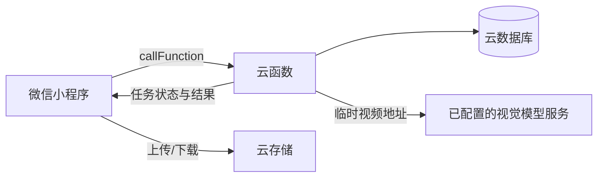

# 师傅在吗 / Shifu Zaima


[English](README.md) · [项目定位](docs/PROJECT_POSITIONING.md) · [数据处理](docs/DATA_HANDLING.md) · [参与贡献](CONTRIBUTING.md) · [安全政策](SECURITY.md) · [路线图](docs/ROADMAP.md)

“师傅在吗”是一个开源的微信小程序参考实现，旨在连接职前教师、青年教师与具有丰富经验的教育工作者。小程序界面统一使用“师傅在吗”作为产品名称，`yinjiao-bangbang` 作为仓库沿用的内部代码标识。项目基于微信云开发，覆盖教案精修、试讲视频分析、可选的导师侧姓名隐藏（并非完全匿名）、指导订单和站内沟通等流程。

> **项目状态：**公开参考实现 / 早期测试版。适合学习、评估和二次开发，但不是可直接用于生产环境的托管服务。钱包和支付为演示逻辑；导师权限采用显式审批状态和服务端校验，生产部署仍需提供合规的身份核验渠道及可审计的审核流程。

本项目不宣称首创学员/教师角色、双边订单、消息或教育小程序。它的贡献是一套经过文档化和测试的导师服务流程与服务端授权交互组合。详见[项目定位与相关工作](docs/PROJECT_POSITIONING.md)。

## 界面预览

[历史界面示意图（已脱敏）](docs/images/interface-overview.png)包含首页、磨课坊、问诊室和个人中心，但早于当前代码，仍有旧的示例数字和响应时效文案，**均不构成已实现功能或服务承诺**。用户 ID 与钱包余额虽已遮挡，但此图不能作为当前功能、真实交易或真实用户的验证证据。

## 项目价值

教学经验往往依赖非结构化、封闭的交流渠道。本项目尝试将这种经验传递整理为可复用的数字化流程：

- 职前教师可以围绕教案和试讲发起指导需求；
- 资深教育工作者可以接单并进行异步指导；
- 开发者可以参考一套原生微信小程序与云函数的完整结构；
- 教育类项目可以复用已经文档化的业务流程，而不是从空白模板开始。

## 功能模块

| 模块 | 当前能力 |
| --- | --- |
| 磨课坊 | 上传教案文档并创建精修需求 |
| 诊课室 | 上传试讲视频并创建异步分析任务 |
| 教学问答 | 提交教学困惑并浏览教育资源 |
| 导师工作台 | 浏览、接取、回复和完成指导订单 |
| 消息系统 | 按订单建立文本与语音会话，并校验会话成员 |
| 用户档案 | 学员档案与经独立审批的导师权限 |
| 界面演示 | 明确标注的示例导师与课程卡片；受保护的订单和会话须连接云开发 |

当前视频分析适配器调用智谱 GLM-4V，并集中在 `cloudfunctions/analyzeVideo` 中，方便后续增加其他模型提供商而不修改小程序页面。

## 技术架构



页面负责展示和本地交互；用户档案、订单、会话和消息等受保护的写操作通过云函数完成，云函数使用微信 `OPENID` 识别调用者。更详细的信任边界和数据集合说明见[架构文档](docs/ARCHITECTURE.md)与[部署文档](docs/DEPLOYMENT.md)。

## 项目结构

```text
.
├── pages/                  # 小程序页面
├── cloudfunctions/         # 服务端鉴权与业务操作
├── docs/                   # 架构、部署和路线图
├── security/               # 数据库与云存储安全规则示例
├── scripts/                # 仓库校验脚本
├── tests/                  # 结构测试
├── utils/                  # 小程序客户端共享工具
├── app.js                  # 小程序入口
├── app.json                # 页面和全局界面配置
├── project.config.json     # 通用开发者工具配置
└── seed-contents.json      # 不含敏感信息的示例内容
```

## 快速开始

### 环境要求

- 已启用云开发的微信开发者工具
- 可使用云能力的微信小程序 AppID
- Node.js 18 或更高版本，用于运行仓库校验

### 1. 克隆并校验

```bash
git clone https://github.com/YxCarl/yinjiao-bangbang.git
cd yinjiao-bangbang
npm test
```

仓库默认使用 `touristappid`，不包含任何生产云环境 ID。部署前请在本地配置自己的 AppID，并在开发者工具中选择自己的云环境。

### 2. 创建数据库集合

在云开发控制台创建：

- `users`
- `orders`
- `messages`
- `conversations`
- `contents`
- `aiTasks`
- `rateLimits`

不要开放公共写权限。受保护的数据修改应由页面调用云函数完成。

### 3. 部署云函数

上传并部署 `cloudfunctions/` 下的全部目录，并在开发者工具提示时安装云端依赖。

请先部署 `getProtectedFileURL`，再按照[安全规则文档](docs/SECURITY_RULES.md)的安全顺序和负向测试矩阵应用数据库及云存储规则。如需启用视频分析，请把 `ZHIPU_API_KEY` 配置为 `analyzeVideo` 云函数的服务端环境变量。视频流程采用服务端签发上传路径、每账号每小时最多三个新任务、真实对象小于 200MB 校验、模型异步任务、可恢复轮询以及受限的模型请求。不要把模型密钥写入客户端代码、公共数据库、截图、Issue 或 Git 提交。

### 4. 导入示例内容

如需在资源页面显示演示内容，可将 `seed-contents.json` 导入 `contents` 集合。示例导师卡片、课程目录、评价、价格和钱包不代表真实教师、用户、交易或使用量。

完整步骤、[数据库候选索引清单](docs/INDEXES.md)和生产环境加固清单见 [docs/DEPLOYMENT.md](docs/DEPLOYMENT.md)。

## 可复现验证

运行 `npm test` 会执行仓库结构校验、鉴权策略测试，以及部分订单与消息云函数的行为级测试。行为测试使用部署入口实际导出的依赖注入处理器，并注入确定性的内存数据库适配器，无需任何私有云环境凭据。测试已覆盖订单原子创建、订单/消息请求重放、调用方级订单/消息频控与未读数事务更新；CloudBase 事务的真实执行仍需在隔离环境中验证。

这些测试能够证明本地业务与鉴权决策，不代表 CloudBase SDK 查询、环境权限或已部署安全规则已经运行。证据层级和隔离环境验证矩阵见[测试与证据](docs/TESTING.md)。

## 安全与隐私说明

- 启用视频分析时，系统会把课堂视频的临时访问地址发送给所配置的外部模型服务。处理真实课堂录像前必须取得知情同意并制定保留期限。
- 选择导师入口不会直接获得导师权限；申请人在可信管理员明确批准前始终保持学员权限，具体见[导师审批文档](docs/MENTOR_APPROVAL.md)。
- 数据库和云存储权限取决于具体部署，仓库不会假设一套通用规则。建议从默认拒绝开始，只开放最小必要权限。
- 钱包仅用于界面演示，不构成支付、结算或财务系统。
- 不要在公共测试环境中使用真实学生档案、未成年人信息、课堂录像或凭据。

部署或报告漏洞前请阅读 [SECURITY.md](SECURITY.md)。

## 发布与分发

本仓库是完整的微信小程序应用，不是 npm 库，也不需要制作桌面或手机安装包。GitHub Release 用于发布带版本标签、可审查的源码快照；每个 Release 都会由 GitHub 自动提供 ZIP 和 TAR.GZ 源码包。

运行 Release 时，下载源码、使用微信开发者工具导入、配置自己的 AppID 和云开发环境，再部署云函数。通过微信开发者工具或 `miniprogram-ci` 上传到微信平台属于另一套部署流程，其中使用的上传密钥必须始终保密。

项目不会发布 `.wxapkg`、AppID 密钥、代码上传密钥、生产云环境标识或真实用户数据。第一个公开测试版的范围和验证方法见 [v0.1.0 发布说明](docs/releases/v0.1.0.md)。

## 维护与贡献

公开路线图见 [docs/ROADMAP.md](docs/ROADMAP.md)。建议每项改动先建立 Issue，再通过聚焦的 Pull Request 提交，并附上校验结果。版本变更记录维护在 [CHANGELOG.md](CHANGELOG.md)。

当前主要维护者为 [@YxCarl](https://github.com/YxCarl)，维护职责和决策规则见 [GOVERNANCE.md](GOVERNANCE.md)。欢迎阅读 [CONTRIBUTING.md](CONTRIBUTING.md) 后参与贡献，并在提交前运行 `npm test`。

## 开源协议

本项目采用 [MIT License](LICENSE)。
