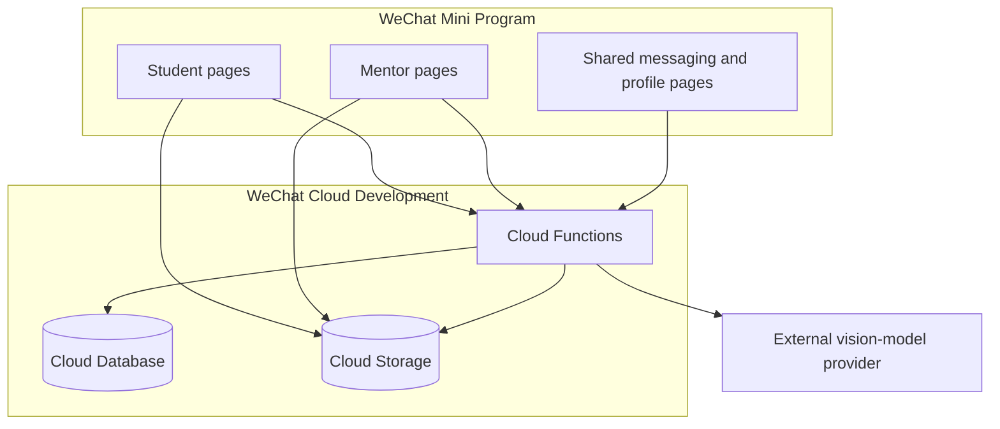

# Architecture

## Components

## Trust boundaries

The Mini Program client is untrusted. A caller can modify request payloads, local storage, role fields, document IDs, and page parameters. Cloud Functions therefore derive the caller's `OPENID` from `cloud.getWXContext()` and must authorize every protected record access.

Database and storage rules form a second boundary. The published baseline denies all direct client database access and permits direct storage access only to the file creator. Cross-user downloads go through `getProtectedFileURL`, which verifies the referenced order, conversation, message, or content record before issuing a temporary URL. See [Security rules](SECURITY_RULES.md).

The configured video-analysis provider is an external processor. A temporary video URL and task instructions cross that boundary. Deployment owners must obtain consent, document the provider, and define retention and deletion behavior.

## Test boundary

Critical order and messaging functions separate their deployed entry point, Cloud Database adapter, and dependency-injected handler. The entry point obtains the trusted WeChat identity and wires the real SDK adapter. Behavior tests execute that same handler with a deterministic in-memory adapter, so authorization and state transitions can be tested without copying the business logic or requiring private cloud credentials.

This seam does not emulate CloudBase. SDK query behavior, indexes, environment permissions, identity context, and security rules still require the isolated deployment matrix. See [Testing and evidence](TESTING.md).

## Collections

| Collection | Purpose | Sensitive fields or concerns |
| --- | --- | --- |
| `users` | Student profiles, mentor applications, and approved mentor profiles | `OPENID`, profile attributes, role, approval state, balance demo |
| `orders` | Guidance requests and assignments | Student/mentor identity, descriptions, attachment IDs |
| `messages` | Per-conversation messages | Message content, voice-file IDs, sender `OPENID` |
| `conversations` | Membership and message previews | Participant `OPENID`, unread count |
| `contents` | Public educational resources | Editorial integrity and publishing permissions |
| `aiTasks` | Video-analysis task state | Owner `OPENID`, uploaded file ID, analysis output |

## Main workflows

### Create and claim an order

1. The client creates a bounded request ID and reuses it when a network result is ambiguous.
2. A student calls `addOrder`; the function derives the caller identity and strictly validates the request.
3. A caller-scoped hash of the request ID becomes the deterministic order document ID.
4. One Cloud Database transaction rechecks the student profile, detects a replay, checks the simulated balance, deducts it, and creates the order. The balance and order therefore commit or roll back together.
5. An applicant submits through `submitMentorApplication`, which records `pending` while retaining student permissions.
6. A trusted operator independently verifies the application and records both `role: mentor` and `mentorStatus: approved` outside the client.
7. An approved mentor calls `grabOrder`.
8. The function verifies both approval fields, updates the order, and creates one conversation-membership record for each participant.

Only the assigned mentor can later mark the order complete through `completeOrder`.

### Exchange messages

1. A participant supplies a conversation ID to `sendMessage` or `getMessages`.
2. Non-order conversations require a membership document matching the caller's `OPENID`.
3. Order conversations recheck the order owner or the assigned mentor's current approval; a stale or forged membership document never grants access.
4. Message previews and unread counters are updated only for the currently authorized order participants.
5. Only then does the function list, read, or append messages.

### Open a protected file

1. The client supplies a record reference, not a trusted access decision.
2. `getProtectedFileURL` resolves the stored file ID from an order or content record, or verifies that a supplied voice file ID belongs to the authorized conversation.
3. Order attachments require the student owner or assigned mentor; voice messages require conversation membership.
4. The function returns a temporary URL only after authorization. The storage bucket remains non-public.

### Analyze a video

1. A user uploads a video to Cloud Storage.
2. `analyzeVideo` validates the cloud file ID and creates an owner-bound task.
3. The function obtains a temporary URL and calls the configured provider using a server-side environment variable.
4. Polling the task requires the same owner `OPENID`.
