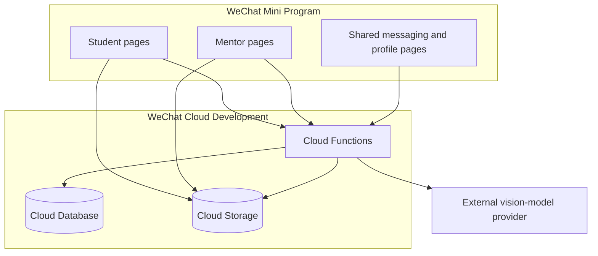

# Architecture

## Components

## Trust boundaries

The Mini Program client is untrusted. A caller can modify request payloads, local storage, role fields, document IDs, and page parameters. Cloud Functions therefore derive the caller's `OPENID` from `cloud.getWXContext()` and must authorize every protected record access.

Database and storage rules form a second boundary. The published baseline denies all direct client database access and permits direct storage access only to the file creator. Cross-user downloads go through `getProtectedFileURL`, which verifies the referenced order, conversation, message, or content record before issuing a temporary URL. See [Security rules](SECURITY_RULES.md).

The configured video-analysis provider is an external processor. A temporary video URL and task instructions cross that boundary. Deployment owners must obtain consent, document the provider, and define retention and deletion behavior.

## Test boundary

Critical order and messaging functions separate their deployed entry point, Cloud Database adapter, and dependency-injected handler. The entry point obtains the trusted WeChat identity and wires the real SDK adapter. Behavior tests execute that same handler with a deterministic in-memory adapter, so authorization and state transitions can be tested without copying the business logic or requiring private cloud credentials.

This seam does not emulate CloudBase. SDK query behavior, indexes, environment permissions, identity context, and security rules still require the isolated deployment matrix. See [Testing and evidence](TESTING.md).

## Collections

| Collection | Purpose | Sensitive fields or concerns |
| --- | --- | --- |
| `users` | Student profiles, mentor applications, and approved mentor profiles | `OPENID`, profile attributes, role, approval state, balance demo |
| `orders` | Guidance requests and assignments | Student/mentor identity, descriptions, attachment IDs |
| `messages` | Per-conversation messages | Message content, voice-file IDs, sender `OPENID` |
| `conversations` | Membership and message previews | Participant `OPENID`, unread count |
| `contents` | Public educational resources | Editorial integrity and publishing permissions |
| `aiTasks` | Video-analysis task state | Owner `OPENID`, uploaded file ID, analysis output |
| `rateLimits` | Server-only fixed-window counters | Owner `OPENID`, operation scope, expiry metadata |

## Main workflows

### Create and claim an order

1. The client creates a bounded request ID and reuses it when a network result is ambiguous.
2. A student calls `addOrder`; the function derives the caller identity and strictly validates the request.
3. A caller-scoped hash of the request ID becomes the deterministic order document ID.
4. One Cloud Database transaction rechecks the student profile, detects a replay, checks the simulated balance, deducts it, and creates the order. The balance and order therefore commit or roll back together.
5. An applicant submits through `submitMentorApplication`, which records `pending` while retaining student permissions.
6. A trusted operator independently verifies the application and records both `role: mentor` and `mentorStatus: approved` outside the client.
7. An approved mentor calls `grabOrder`.
8. The function verifies both approval fields, updates the order, and creates one conversation-membership record for each participant.

Only the assigned mentor can later mark the order complete through `completeOrder`.

### Upload a lesson plan

1. The client creates or reuses the order request ID and sends the document name and declared byte size to `addOrder` with `prepare_document`.
2. The function accepts only DOC, DOCX, or PDF metadata up to 50MB and derives a caller- and request-scoped storage path without exposing `OPENID`.
3. The client uploads to that exact path and includes the resulting cloud file ID plus the original byte size in the final order request.
4. Before a new order is created, `addOrder` rejects any other object path, obtains a temporary URL server-side, and verifies the actual object size with a bounded range request.
5. A confirmed replay returns the existing order without requiring the attachment to remain remotely available or charging the simulated wallet again.

### Exchange messages

1. A participant supplies a conversation ID to `sendMessage` or `getMessages`.
2. Non-order conversations require a membership document matching the caller's `OPENID`.
3. Order conversations recheck the order owner or the assigned mentor's current approval; a stale or forged membership document never grants access.
4. New messages require a caller-scoped request ID and share a fixed one-minute rate counter.
5. Voice messages first request an owner-bound upload path derived from the same message ID; sending rejects any cloud file outside that exact path.
6. The message document, sender preview, authorized peer preview/unread count, and rate counter commit in one transaction; replaying the same request ID returns the existing result without another unread increment.
7. Reads still return content only after the same order or membership authorization succeeds.

### Open a protected file

1. The client supplies a record reference, not a trusted access decision.
2. `getProtectedFileURL` resolves the stored file ID from an order or content record, or verifies that a supplied voice file ID belongs to the authorized conversation.
3. Order attachments require the student owner or assigned mentor; voice messages require conversation membership.
4. The function returns a temporary URL only after authorization. The storage bucket remains non-public.

### Analyze a video

1. The client asks `analyzeVideo` to prepare an owner-bound task with bounded file metadata and a replay-safe request ID.
2. A transaction creates the task and increments a caller-scoped hourly counter; repeated request IDs do not consume another slot.
3. The server returns an unpredictable task-specific Cloud Storage path, and the client uploads only to that path.
4. Starting analysis rechecks task ownership and requires the uploaded cloud file ID to match the server-issued path.
5. Before invoking the configured external provider, the server verifies the actual object size through a one-byte range request and obtains a temporary URL.
6. The Cloud Function submits an asynchronous provider job, stores only its server-side task ID, and returns without waiting for inference to finish.
7. Owner-authenticated status calls query the provider job. Completed timelines are normalized and stored; transient query failures remain retryable, while provider failures and the 15-minute processing deadline fail closed.
8. Polling returns only public task fields and requires the same owner `OPENID`.
