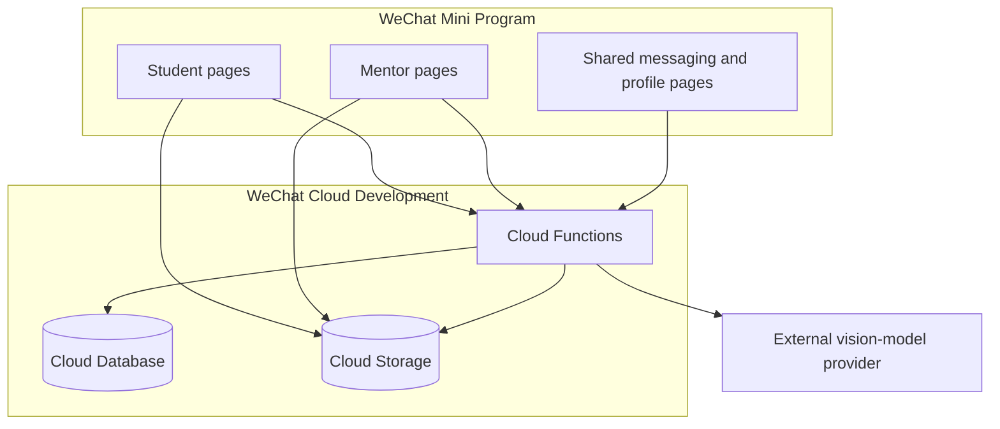

# Architecture

## Components

## Trust boundaries

The Mini Program client is untrusted. A caller can modify request payloads, local storage, role fields, document IDs, and page parameters. Cloud Functions therefore derive the caller's `OPENID` from `cloud.getWXContext()` and must authorize every protected record access.

Database and storage rules form a second boundary. The published baseline denies all direct client database access and permits direct storage access only to the file creator. Cross-user downloads go through `getProtectedFileURL`, which verifies the referenced order, conversation, message, or content record before issuing a temporary URL. See [Security rules](SECURITY_RULES.md).

The configured video-analysis provider is an external processor. A temporary video URL and task instructions cross that boundary. Deployment owners must obtain consent, document the provider, and define retention and deletion behavior.

## Collections

| Collection | Purpose | Sensitive fields or concerns |
| --- | --- | --- |
| `users` | Student profiles, mentor applications, and approved mentor profiles | `OPENID`, profile attributes, role, approval state, balance demo |
| `orders` | Guidance requests and assignments | Student/mentor identity, descriptions, attachment IDs |
| `messages` | Per-conversation messages | Message content, voice-file IDs, sender `OPENID` |
| `conversations` | Membership and message previews | Participant `OPENID`, unread count |
| `contents` | Public educational resources | Editorial integrity and publishing permissions |
| `aiTasks` | Video-analysis task state | Owner `OPENID`, uploaded file ID, analysis output |

## Main workflows

### Create and claim an order

1. A student calls `addOrder`.
2. The function resolves the caller, validates the request, and creates the order.
3. An applicant submits through `submitMentorApplication`, which records `pending` while retaining student permissions.
4. A trusted operator independently verifies the application and records both `role: mentor` and `mentorStatus: approved` outside the client.
5. An approved mentor calls `grabOrder`.
6. The function verifies both approval fields, updates the order, and creates one conversation-membership record for each participant.

Only the assigned mentor can later mark the order complete through `completeOrder`.

### Exchange messages

1. A participant supplies a conversation ID to `sendMessage` or `getMessages`.
2. The function verifies a membership document matching the caller's `OPENID`.
3. For order conversations, an assigned mentor's approval is rechecked so revocation takes effect even when a membership document already exists.
4. Only then does it read or append messages.

### Open a protected file

1. The client supplies a record reference, not a trusted access decision.
2. `getProtectedFileURL` resolves the stored file ID from an order or content record, or verifies that a supplied voice file ID belongs to the authorized conversation.
3. Order attachments require the student owner or assigned mentor; voice messages require conversation membership.
4. The function returns a temporary URL only after authorization. The storage bucket remains non-public.

### Analyze a video

1. A user uploads a video to Cloud Storage.
2. `analyzeVideo` validates the cloud file ID and creates an owner-bound task.
3. The function obtains a temporary URL and calls the configured provider using a server-side environment variable.
4. Polling the task requires the same owner `OPENID`.
