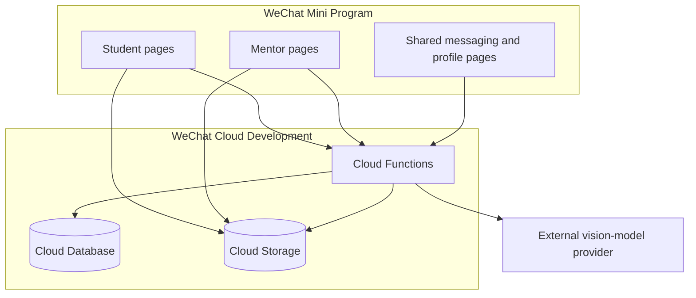

# Architecture

## Components

## Trust boundaries

The Mini Program client is untrusted. A caller can modify request payloads, local storage, role fields, document IDs, and page parameters. Cloud Functions therefore derive the caller's `OPENID` from `cloud.getWXContext()` and must authorize every protected record access.

Database and storage rules form a second boundary. Production deployments should deny direct writes from the client and expose narrowly scoped mutations through Cloud Functions.

The configured video-analysis provider is an external processor. A temporary video URL and task instructions cross that boundary. Deployment owners must obtain consent, document the provider, and define retention and deletion behavior.

## Collections

| Collection | Purpose | Sensitive fields or concerns |
| --- | --- | --- |
| `users` | Student and mentor profiles | `OPENID`, profile attributes, role, balance demo |
| `orders` | Guidance requests and assignments | Student/mentor identity, descriptions, attachment IDs |
| `messages` | Per-conversation messages | Message content, voice-file IDs, sender `OPENID` |
| `conversations` | Membership and message previews | Participant `OPENID`, unread count |
| `contents` | Public educational resources | Editorial integrity and publishing permissions |
| `aiTasks` | Video-analysis task state | Owner `OPENID`, uploaded file ID, analysis output |

## Main workflows

### Create and claim an order

1. A student calls `addOrder`.
2. The function resolves the caller, validates the request, and creates the order.
3. A mentor calls `grabOrder`.
4. The function verifies a mentor profile, updates the order, and creates one conversation-membership record for each participant.

Only the assigned mentor can later mark the order complete through `completeOrder`.

### Exchange messages

1. A participant supplies a conversation ID to `sendMessage` or `getMessages`.
2. The function verifies a membership document matching the caller's `OPENID`.
3. Only then does it read or append messages.

### Analyze a video

1. A user uploads a video to Cloud Storage.
2. `analyzeVideo` validates the cloud file ID and creates an owner-bound task.
3. The function obtains a temporary URL and calls the configured provider using a server-side environment variable.
4. Polling the task requires the same owner `OPENID`.
